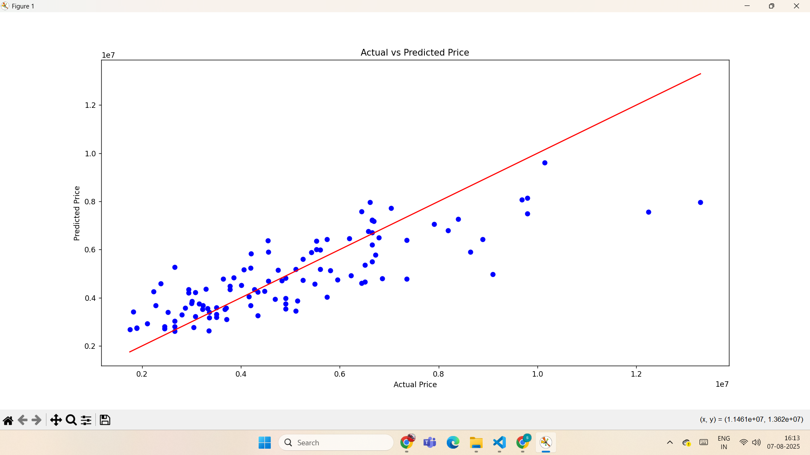

# 🏡 Linear Regression - House Price Prediction

This project is a complete implementation of **simple and multiple linear regression** to predict house prices using various features like area, bedrooms, bathrooms, and furnishing status. It is developed as part of **Task 3** in the AI/ML Internship program.

---

## 📌 Objective

To learn and apply **linear regression modeling** to real-world housing data. The goal is to predict the `price` of a house based on other known features in the dataset using **Scikit-learn**, **Pandas**, and **Matplotlib**.

---

## 🛠️ Tools & Libraries Used

- Python 🐍
- Pandas 📊
- NumPy ➕➖
- Scikit-learn 🤖
- Matplotlib 📈

---

## 📁 Dataset

The dataset used is from the Housing Price Prediction dataset on Kaggle:  
https://www.kaggle.com/datasets/harishkumardatalab/housing-price-prediction

Key columns include:
- `area` — total square feet of the house
- `bedrooms`, `bathrooms` — number of rooms
- `stories`, `parking` — additional house features
- `furnishingstatus` — furnished, semi-furnished, or unfurnished (encoded)
- `price` — target variable to predict

---

## 🚀 Project Steps

1. **Imported** the dataset using `pandas`.
2. **Preprocessed** the data:
   - Checked for missing values.
   - Converted categorical text columns to numeric using one-hot encoding.
3. **Split** the data into training and testing sets using `train_test_split`.
4. **Trained** a `LinearRegression` model using the training set.
5. **Evaluated** the model using:
   - Mean Absolute Error (MAE)
   - Mean Squared Error (MSE)
   - R² Score
6. **Visualized** the results with an actual vs predicted price plot.

---

## 📉 Evaluation Results

(Your actual output here — update after running)

- ✅ Mean Absolute Error (MAE):  XXXXX
- ✅ Mean Squared Error (MSE):  XXXXX
- ✅ R² Score:                  0.XX (closer to 1 = better)

---

## 📈 Plot

The graph below shows the predicted house prices versus actual prices. The red line indicates perfect predictions — closer the blue dots are to this line, the better the model performance.

 

---

## 🔍 What I Learned

- How to use **Linear Regression** for real-world data
- How to handle **categorical variables**
- How to **evaluate** model accuracy using multiple metrics
- Importance of **visualizing** prediction results

---

